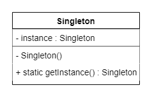
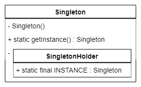
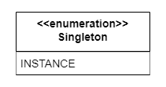

# The Singleton Pattern

## 1. Greed Singleton

## 2. Lazy Initialization (Thread-unsafe)

## 3. Lazy Initialization (Thread-safe)

## 4. Double-Checked Locking / DCL

## 5. Static Inner Class

## 6. Enum Singleton
